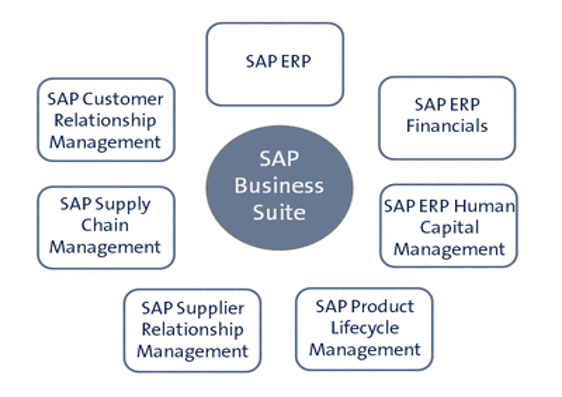
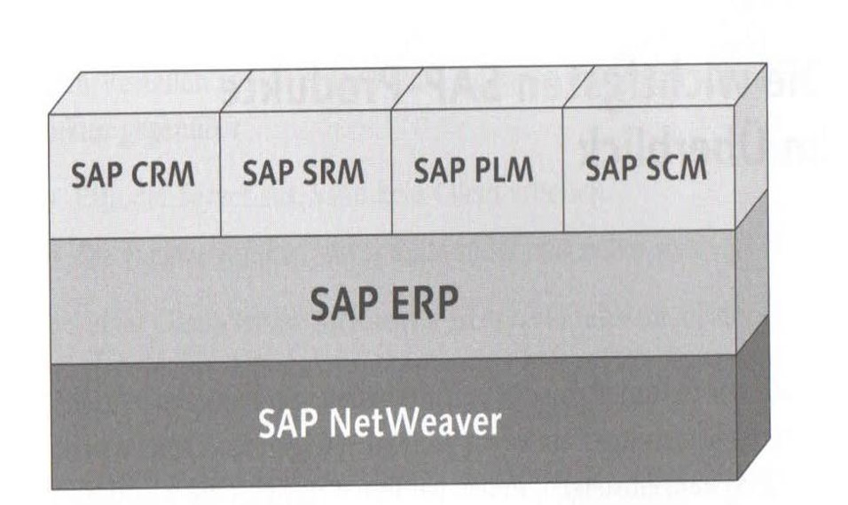

= SAP Mitschrift

:toc:

== Kurzübersicht

- Walldorf: Headquarters von SAP (Deutschland)
- SAP = "Systems, Applications and Products in Data Processing"
- Standardsoftware, anpassbar durch Customizing und Erweiterungen (ABAP, SAP Fiori)

== Systemüberblick

=== SAP R/3 (ERP)

- Version: ERP 6.0 EHP8
- Datenbank: Oracle 19c
- Programmiersprache: ABAP (Advanced Business Application Programming)

=== SAP S/4HANA

- Erstveröffentlichung: 2015
- In-Memory-Datenbank: SAP HANA
- Oberfläche: SAP Fiori (UX), Backend-Entwicklung in ABAP

[cols="1,1",options="header"]
|===
|Abkürzung |Bedeutung

|EHP |Enhancement Package
|HANA |High-Performance Analytic Appliance
|ABAP |Advanced Business Application Programming
|FIORI |SAP Fiori (Benutzeroberfläche)
|===

== Anpassbarkeit

=== Customizing

- Grundeinstellungen des Systems
- Ergänzen von Auswahllisten
- Abbilden von Geschäftsprozessen

Wenn der Standard nicht ausreicht: ABAP-Entwicklung (z. B. User-Exits, BAdIs, kundenspezifische Klassen).

== Module (Auswahl)

- FI — Financial Accounting
- MM — Materials Management
- HCM — Human Capital Management
- CRM — Customer Relationship Management
- SRM — Supplier Relationship Management
- PLM — Product Lifecycle Management
- SCM — Supply Chain Management

== SAP Business Suite

== Prozesse und Datenmigration

Datenmigration: Daten zwischen Systemen portieren / migrieren.

== Übungen

=== Aufgabe 1 — Materialstamm anlegen

- Primary Key: Eindeutige Identifikation eines Datensatzes — darf nicht geändert werden.
- Wichtige Stammdatenfelder:
	* Mandant (z. B. 100)
	* Buchungskreis (z. B. 1010)
	* Werk (z. B. 1010)
	* Lagerort (z. B. 0001)

==== Schritte (Kurz)

1. Transaktion `mm01` öffnen
2. Pflichtfelder ausfüllen
3. Speichern

=== Aufgabe 2 — Anforderungen an Geschäftsprozesse

- Einmal erfasste Daten sollten nicht mehrfach erfasst werden.
- Alle beteiligten Systeme sollten mit denselben Stammdaten arbeiten.
- Externe Systeme (Kunden, Lieferanten) sollten Daten erhalten können.

==== Beispiel: Materialwirtschaft (vereinfachter Ablauf)

BANF -> Anfrage -> Angebot -> Bestellung -> Wareneingang

image::assets/Bild3.jpg[Materialwirtschaft Ablauf]
image::assets/Bild4.jpg[Materialwirtschaft Ablauf]

== Transaktionscodes (Auswahl)

- `mm01` — Material anlegen
- `mm02` — Material ändern
- `mm03` — Material anzeigen
- `mmbe` — Bestandsübersicht

== Glossar

- **Best Practice:** Vorlagen, Installations- und Übungsdatenbanken
- **Brownfield:** Bestehende Systeme werden aktualisiert/migriert
- **Greenfield:** Neues System wird von Grund auf neu implementiert
